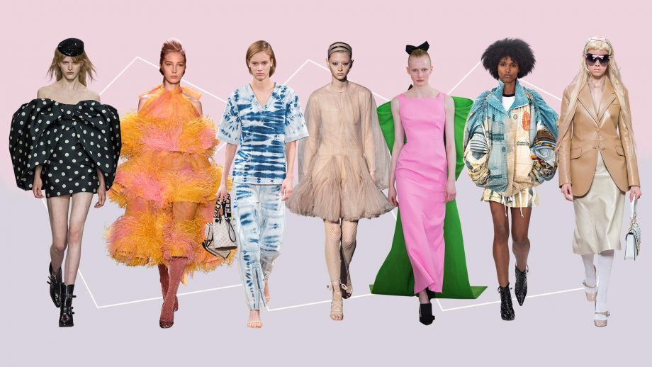
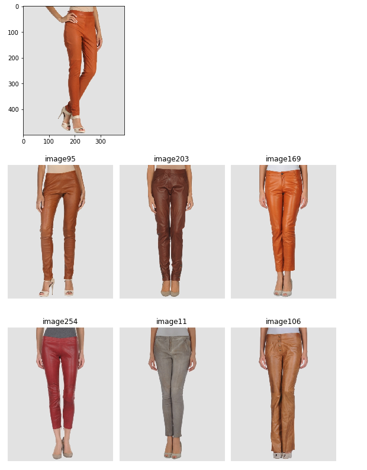
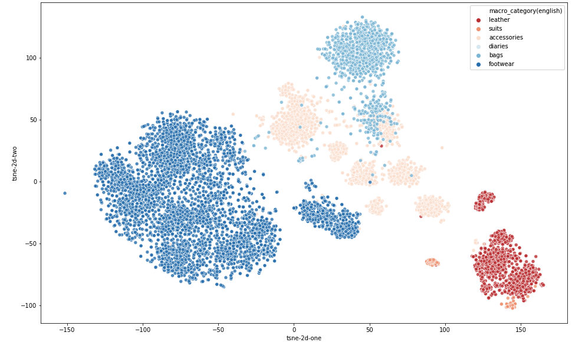

# Fashion Recommendation System
A fashion recommendation system that will suggest similar clothes based on their description ( i.e colour, category). To create this I will be using convolutional neural network (CNN) and neural network embeddings. 

# Data
Fashion images and dataset with fashion annotation is from [ImageLab](http://imagelab.ing.unimore.it/imagelab2015/researchactivity.asp?idAttivita=18)  
Imagelab is a research laboratory at the Dipartimento di Ingegneria "Enzo Ferrari", University of Modena and Reggio Emilia, Italy. 
From the link provided above, ~ 60,000 fashion images were obtained along with the Dataframe with has the descriptions on the images.

# Introduction 
An increasing number of online fashion companies are utilizing recommendation systems to increase user interaction and enhance the shopping experience. Companies like ASOS and Zalando have a massive offering of clothes and accessories. Although these companies give customers a wider range of clothes to choose from, they may become overwhelmed and have a difficult time making a decision when faced with many options. This is where recommendation systems step in, it suggest the most relevant items to buy and, as a result, increase a company’s revenue. In this notebook, I will be building a fashion recommendation system that will suggest similar clothes based on their description.


### Technologies

Project is created with:
* Python version: 3.7
* Jupyter Notebook

### Setup
To run this project, install it locally using pip:
```
!pip install PIL
!pip install Swifter
!pip install keras
!pip install opencv-python
```
### Summary of files
fashion.py: Includes functions that perform the following tasks;

- Deleting rows with null values and duplicated rows
- Translating column names to english
- ResNet Model 
- Embedding of images

Fashion_RC.ipynb: Technical notebook that includes

- Asuumption checks
- Visualisation of EDA
- Feature Selection
- Neural Network model
- T-SNE 

Recommendation powerpoint: Includes a powerpoint about the business case for using a recommendation system in Fashion.

### Visualizations

All visualizations were presented using matplotlip and Pillow (PIL Fork) libraries 

# Convolutional Neural Networks
In order to recommend similiar fashion images to an input image, we must first classify the images. To do this we use deep convolutional neural networks. This is used to could be extract high level representations of the image content. Instead of preprocessing the data to derive features like textures and shapes, a CNN takes the image’s raw pixel data as input and “learns” how to extract these features, and determines what the object is. For this project, a pre trained ResNet-50 model is used.

## ResNet-50
ResNet is characterized by the residual block structure. This incorporates identity shortcut connections which essentially skip the training of one or more layers. In the Keras package, I loaded the ResNet-50 model and download weights pretrained on ImageNet dataset(ImageNet is a large visual database designed for use in visual object recognition software research).

Below is a snippet of python code of ResNet-50 model code and summery
```python
im = Image.open(image_path)
width, height = im.size
# Pre-Trained Model
base_model = ResNet50(weights='imagenet', 
                      include_top=False, 
                      input_shape = (197, 197, 3))
base_model.trainable = False

# Add Layer Embedding
model = models.Sequential([
    base_model,
    GlobalMaxPooling2D()
])

model.summary()
```
```
_________________________________________________________________
Layer (type)                 Output Shape              Param #   
=================================================================
resnet50 (Model)             (None, 7, 7, 2048)        23587712  
_________________________________________________________________
global_max_pooling2d_1 (Glob (None, 2048)              0         
=================================================================
Total params: 23,587,712
Trainable params: 0
Non-trainable params: 23,587,712
_________________________________________________________________
```


## Neural Network Embedding

Neural networks embeddings are low-dimensional, learned continuous vector representations of discrete variables. Neural network embeddings are useful because they can reduce the dimensionality of categorical variables and meaningfully represent categories in the transformed space. Neural network embeddings have 3 primary purposes:

- Finding nearest neighbors in the embedding space. These can be used to make recommendations based on user interests or cluster categories.
- As input to a machine learning model for a supervised task.
- For visualization of concepts and relations between categories.

We can reduce the dimensonality of the input fashion images and convert them to vectors. Then use cosine similarity to find the distance between different images. When we have calculated all the images' distance to one another, we can find the closest images to an input image.

# Result 

By selecting a fashion image, six images that have the closest distance to the input image are plotted.



# TSNE Visualization of Fashion Embedding

TSNE: t-Stochastic Distributed Neighbors Embedding, are  methods that use the idea of a manifold to map vecotrs to a lower dimensional embedded space. Therefore, we are taking the ~7500 fashion images, and then embedding them down to 2 dimensions to plot them on a graph. The primary idea behind dimension reduction is that there is a lower dimensional representation of the vectors that can still capture the variation between different groups. We want the embeddings to represent similar images close to one another but in fewer dimensions that allow us to visualize the entities.


# Acknowledgement

I would like to thank Flatiron school and the Flatiron coaches; Dan, Dave, Wachira and Jon Tyler for thier help and guidance in my project

# Further Work

Next steps would be to build a website using Flask or any other web application framework and have the recommendation system running in the backend. Therefore users can select clothes and the website will suggest them similar clothes.


